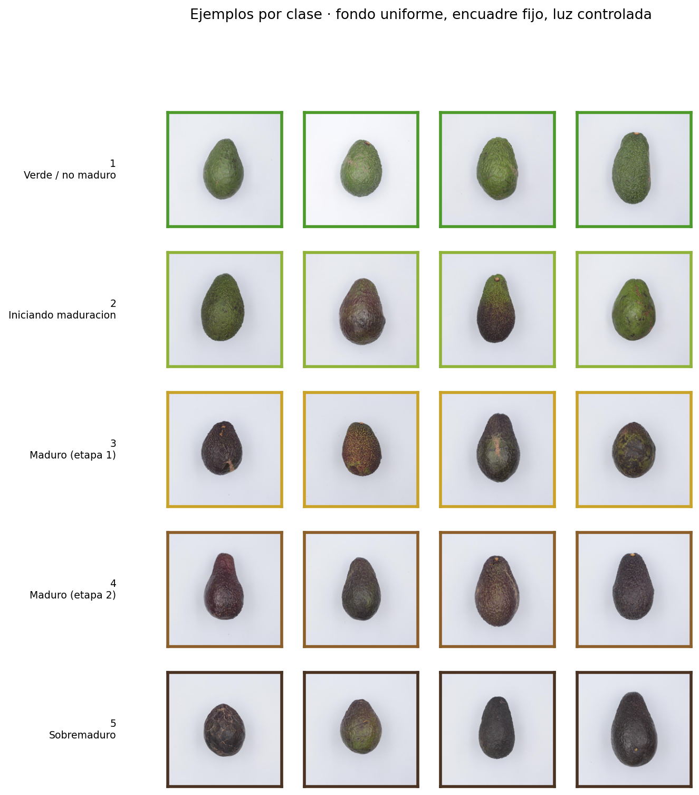

# Clasificación del estado de madurez de paltas Hass

Comparación controlada entre una **CNN (ResNet-50)** y un **Vision Transformer (ViT-S/16)**
equiparados en parámetros, cómputo y datos de pre-entrenamiento, sobre la predicción del
índice de madurez de 5 niveles de paltas Hass a partir de fotografías; y evaluación de dos
arquitecturas **híbridas** que combinan ambos enfoques.

<p align="center">
  
</p>

---

## 1. El problema

En Chile la palta Hass se comercializa en un rango de madurez muy estrecho. La clasificación
se hace hoy a ojo y al tacto, lo que produce dos costos simétricos: fruta enviada a góndola
antes de tiempo (el consumidor la descarta) y fruta que pasa su punto en tránsito (pérdida
total). Un clasificador visual barato, que corra sobre la foto de un celular en el punto de
empaque, permite ordenar el flujo por estado de madurez en vez de por fecha de cosecha.

La tarea es **ordinal**, no categórica: 1 < 2 < 3 < 4 < 5. Confundir un estado 1 con un 2 es un
error de un día; confundir un 1 con un 5 es mandar fruta podrida a la venta. Todas las
métricas del proyecto reflejan esa asimetría.

| Índice | Estado | Decisión operativa |
|:--:|---|---|
| 1 | Verde / no maduro | Dejar madurar |
| 2 | Iniciando maduración | Lista en 2-3 días |
| 3 | Maduro (etapa 1) | Venta inmediata |
| 4 | Maduro (etapa 2) | Último día de vida útil |
| 5 | Sobremaduro | Fuera de punto |

## 2. Datos

**Hass Avocado Ripening Photographic Dataset** (Mendeley Data, DOI
[10.17632/3xd9n945v8.1](https://data.mendeley.com/datasets/3xd9n945v8/1)) — 14.710 fotografías
de 800×800 px de 478 paltas Hass, fotografiadas a diario por ambas caras (a/b) bajo tres
regímenes de almacenamiento (T10: 10 °C/85 % HR; T20: 20 °C/85 % HR; Tamb: ambiente).

Ver la **[data card](entregables/final/data_card.md)** para origen, licencia, sesgos conocidos
y detalle de las particiones.

### El riesgo principal: fuga de datos longitudinal

El dataset sigue a **la misma fruta durante hasta 26 días**. Dos fotos consecutivas de la
palta #173 son casi idénticas: misma piel, mismas manchas, misma forma. Un split aleatorio
por imagen pondría el día 5 en train y el día 6 en test, y el modelo podría *reconocer la
fruta* en lugar de aprender el estado de madurez.

Por eso particionamos **las 478 frutas, no las 14.710 imágenes**, estratificando por grupo de
almacenamiento. Ninguna fruta aparece en dos particiones, y hay un `assert` en
[`src/paltas/splits.py`](src/paltas/splits.py) que falla si eso ocurriera.

| Partición | Imágenes | Frutas | % imágenes |
|---|--:|--:|--:|
| train | 10.208 | 334 | 69,4 % |
| val | 2.240 | 72 | 15,2 % |
| test | 2.262 | 72 | 15,4 % |

## 3. Diseño de la comparación

Comparar "una ResNet" contra "un ViT" sin igualar el presupuesto no dice nada: cualquier
diferencia puede atribuirse al tamaño. Aquí se igualan **tres ejes a la vez**:

| | ResNet-50 | ViT-S/16 (DeiT-S) | Diferencia |
|---|--:|--:|--:|
| Parámetros | 23,52 M | 21,67 M | 8,5 % |
| GFLOPs @224 px | 8,17 | 8,48 | 3,8 % |
| Pre-entrenamiento | ImageNet-1k | ImageNet-1k | — |

El tercer eje es el que se suele pasar por alto y el que más distorsiona. Los pesos ViT-S más
usados de `timm` (`vit_small_patch16_224.augreg_in21k_ft_in1k`) vienen de **ImageNet-21k**,
catorce veces más datos que los de la ResNet. Con esos pesos la comparación mediría el tamaño
del corpus de pre-entrenamiento, no la arquitectura. Usamos **DeiT-S**
(`deit_small_patch16_224.fb_in1k`), que es exactamente la arquitectura ViT-S/16 pero entrenada
solo en ImageNet-1k, frente a `resnet50.a1_in1k`.

La receta de entrenamiento es idéntica para ambos (AdamW, coseno con warmup, AMP fp16, label
smoothing, class weights, recorte de gradiente, early stopping por QWK de validación). Lo
único que cambia es lo que **tiene** que cambiar: el ViT usa LR 3× menor, warmup más largo y
`drop_path=0.1`, porque diverge con la receta de la ResNet. Igualar el LR "por justicia" no
sería más justo, solo peor para el ViT.

### Métricas

| Métrica | Por qué |
|---|---|
| **QWK** (kappa cuadrático) | **Métrica principal.** Penaliza el error según el cuadrado de la distancia entre clases y corrige por acuerdo azaroso |
| MAE | Error medio en "escalones" de madurez, directamente interpretable |
| Accuracy ±1 | Fracción de predicciones en la clase correcta o adyacente: aproxima la utilidad operativa |
| Macro-F1 | Controla que las clases minoritarias no queden abandonadas |
| Accuracy | Incluida por comparabilidad con la literatura, pero es la menos informativa aquí |

Los intervalos de confianza se calculan con **bootstrap agrupado por fruta**: las 2.262
imágenes de test vienen de solo 72 paltas, así que asumir independencia entre imágenes daría
intervalos artificialmente angostos. Las comparaciones entre modelos usan bootstrap
**pareado** sobre las mismas frutas.

## 4. Resultados

Test: 2.262 imágenes de 72 frutas que ningún modelo vio durante el entrenamiento.

| Modelo | Params | GFLOPs | QWK | Accuracy | Macro-F1 | MAE | Acc. ±1 | min |
|---|--:|--:|--:|--:|--:|--:|--:|--:|
| ResNet-50 | 23,5 M | 8,17 | 0,9356 | 74,6 % | 0,735 | 0,262 | 99,25 % | 9,9 |
| ViT-S/16 | 21,7 M | 8,48 | 0,9313 | 72,2 % | 0,711 | 0,283 | 99,51 % | 5,0 |
| ResNet-50 *(desde cero)* | 23,5 M | 8,17 | 0,9152 | 67,2 % | 0,655 | 0,352 | 97,66 % | 17,6 |
| ViT-S/16 *(desde cero)* | 21,7 M | 8,48 | 0,8891 | 61,2 % | 0,579 | 0,409 | 98,10 % | 6,0 |
| Híbrido · fusión tardía | 46,4 M | 16,66 | **0,9410** | **76,8 %** | **0,760** | **0,238** | 99,47 % | 3,5 |
| ViT-Hybrid R26+S/32 † | 36,0 M | 6,88 | **0,9411** | 76,2 % | 0,752 | 0,242 | **99,65 %** | 14,9 |

† Usa pesos de ImageNet-21k y 1,5× los parámetros: es cota superior de referencia, no un
competidor equiparable.

**El resultado principal, y es matizado.** Bootstrap pareado agrupado por fruta (2.000 réplicas),
ViT menos ResNet:

| Métrica | Δ | IC 95 % | p | |
|---|--:|:--:|--:|---|
| QWK | −0,0042 | [−0,0095, +0,0006] | 0,095 | **no significativa** |
| Accuracy | −0,0234 | [−0,0435, −0,0039] | 0,026 | significativa |
| Macro-F1 | −0,0241 | [−0,0448, −0,0046] | 0,017 | significativa |

La ResNet acierta la clase exacta significativamente más seguido, pero cuando el ViT se equivoca
lo hace por menos distancia. Sobre la métrica que pondera el error por distancia —la que refleja
el costo operativo real— **las dos arquitecturas son estadísticamente indistinguibles**.
Reportar solo accuracy habría dado "gana la ResNet"; reportar solo QWK habría dado "empatan".

**Dónde sí difieren: la dependencia del pre-entrenamiento.** Al entrenar desde cero, el ViT
pierde 2,1× más QWK y 1,5× más accuracy que la ResNet (−0,0422 contra −0,0203; −11,0 contra
−7,4 puntos). El sesgo inductivo convolucional es un sustituto de datos, y el ViT, que no lo
tiene, debe comprarlo con ImageNet.

**Complementariedad.** ResNet y ViT fallan simultáneamente en solo el 18 % de las imágenes; un
oráculo que eligiera siempre el modelo correcto llegaría a 82,0 % frente al 74,6 % del mejor
individual. Eso es lo que explotan los híbridos, aunque la ganancia final sea modesta: la fusión
tardía mejora +0,0055 de QWK (p = 0,001) a cambio de 2× de cómputo.

Análisis completo en el [informe técnico](entregables/final/informe_tecnico.md).

## 5. Reproducir

### Requisitos

- Python 3.11
- GPU NVIDIA con ≥ 6 GB de VRAM (desarrollado en una RTX 4070 Laptop de 8 GB)
- ~1 GB de disco para el dataset y la caché

### Instalación

```bash
git clone https://github.com/cmartinez1524/clasificacion-de-paltas.git
cd clasificacion-de-paltas
python -m venv .venv && .venv\Scripts\activate    # Windows
pip install torch==2.5.1 torchvision==0.20.1 --index-url https://download.pytorch.org/whl/cu121
pip install -r requirements.txt
```

### Obtener los datos

Descargar el dataset desde [Mendeley Data](https://data.mendeley.com/datasets/3xd9n945v8/1) y
descomprimirlo de modo que quede así:

```
Hass Avocado Ripening Photographic Dataset/
├── Avocado Ripening Dataset/        # 14.710 archivos .jpg
└── Avocado Ripening Dataset.xlsx
```

Si prefieres dejarlo en otra ruta, exporta `PALTAS_RAW_DIR` apuntando a esa carpeta.

### Preparar

```bash
python scripts/00_build_manifest.py    # cruza Excel e imágenes, valida integridad
python scripts/01_make_splits.py       # particiona por fruta -> data/splits.csv
python scripts/02_eda.py               # figuras exploratorias
python scripts/03_cache_images.py      # reescala a 256 px (472 MB -> 125 MB, ~20 s)
```

El paso de caché no es cosmético: entrenamos a 224 px, pero cada época decodificaba 14.710
JPEG de 800×800 y los reducía en CPU, dejando la GPU esperando al dataloader.

### Entrenar

```bash
# Baselines del avance
python scripts/train.py --config configs/resnet50.yaml
python scripts/train.py --config configs/vit_small.yaml

# Ablación sin pre-entrenamiento
python scripts/train.py --config configs/resnet50_scratch.yaml
python scripts/train.py --config configs/vit_small_scratch.yaml

# Híbridos (requieren los dos baselines ya entrenados)
python scripts/train.py --config configs/hybrid_fusion.yaml
python scripts/train.py --config configs/hybrid_vit_r26.yaml
```

Cada corrida escribe `checkpoints/<name>.pt`, `reports/metrics/<name>_history.json`,
`<name>_test.json` y `<name>_test_preds.csv`.

### Comparar y analizar

```bash
python scripts/compare_models.py --models resnet50 vit_small --tag avance
python scripts/04_interpretability.py --mode disagreement
```

### Demo

```bash
python app/gradio_app.py
```

Abre `http://localhost:7860`. Los ejemplos precargados provienen **solo del conjunto de test**:
son frutas que ningún modelo vio durante el entrenamiento.

## 6. Estructura

```
├── configs/                 # un YAML por experimento
├── src/paltas/
│   ├── paths.py             # rutas canónicas del proyecto
│   ├── splits.py            # partición agrupada por fruta + pesos de clase
│   ├── data.py              # dataset, aumentaciones, dataloaders
│   ├── models.py            # ResNet-50, ViT-S/16, híbridos, conteo params/FLOPs
│   ├── engine.py            # bucle de entrenamiento y evaluación
│   ├── metrics.py           # métricas ordinales (QWK, MAE, off-by-one)
│   ├── compare.py           # bootstrap agrupado y pareado, tabla de desacuerdo
│   ├── interpret.py         # Grad-CAM y attention rollout
│   └── viz.py               # estilo común de figuras
├── scripts/                 # 00..04 + train.py + compare_models.py
├── app/gradio_app.py        # demo
├── entregables/
│   ├── avance/              # presentación de avance
│   └── final/               # data card, informe técnico, presentación final
└── reports/{figures,metrics}
```

## 7. Decisiones de diseño

**Aumentaciones de color deliberadamente suaves.** En la mayoría de las tareas de clasificación
el color es una variable molesta que conviene perturbar con fuerza. Aquí el color **es la
señal**: la transición de verde a café oscuro es literalmente la definición del índice. Un
`ColorJitter(brightness=0.4, saturation=0.4, hue=0.1)` convertiría una clase 2 en una clase 4
sin cambiarle la etiqueta, inyectando ruido de etiquetado. Usamos
`brightness=0.15, contrast=0.15, saturation=0.10, hue=0.02`.

**Pesos de clase en vez de remuestreo.** El desbalance es moderado (clase 1: 3.568 imágenes;
clase 2: 2.228, un factor 1,6×). Ponderar la pérdida basta y no altera el tamaño efectivo de
la época.

**Selección de checkpoint por QWK de validación, no por accuracy.** Es la métrica que refleja
el costo real de los errores.

**`cudnn.benchmark = True`.** Acelera notablemente con tamaño de entrada fijo, a cambio de que
la selección de algoritmo no sea determinista. Las corridas son reproducibles a nivel de datos
y pesos iniciales, no bit a bit.

## 8. Entregables

| Entregable | Ubicación |
|---|---|
| Presentación de avance | [`entregables/avance/`](entregables/avance/) |
| Data card | [`entregables/final/data_card.md`](entregables/final/data_card.md) |
| Informe técnico | [`entregables/final/informe_tecnico.md`](entregables/final/informe_tecnico.md) |
| Presentación final | [`entregables/final/`](entregables/final/) |
| Demo | [`app/gradio_app.py`](app/gradio_app.py) |

## 9. Cita

Si usas este dataset, cita a los autores originales:

> Xavier, P.; Rodrigues, P.; Silva, C. L. M. (2024). *"Hass" Avocado Ripening
> Photographic Dataset.* Mendeley Data, V1. https://doi.org/10.17632/3xd9n945v8.1
> — CBQF, Universidade Católica Portuguesa, Porto. Licencia CC BY 4.0.

Arquitecturas y pesos:

> He, K. et al. (2016). *Deep Residual Learning for Image Recognition.* CVPR.
>
> Dosovitskiy, A. et al. (2021). *An Image is Worth 16x16 Words: Transformers for Image
> Recognition at Scale.* ICLR.
>
> Touvron, H. et al. (2021). *Training data-efficient image transformers & distillation
> through attention.* ICML.
>
> Wightman, R. (2019). *PyTorch Image Models (timm).* https://github.com/huggingface/pytorch-image-models
